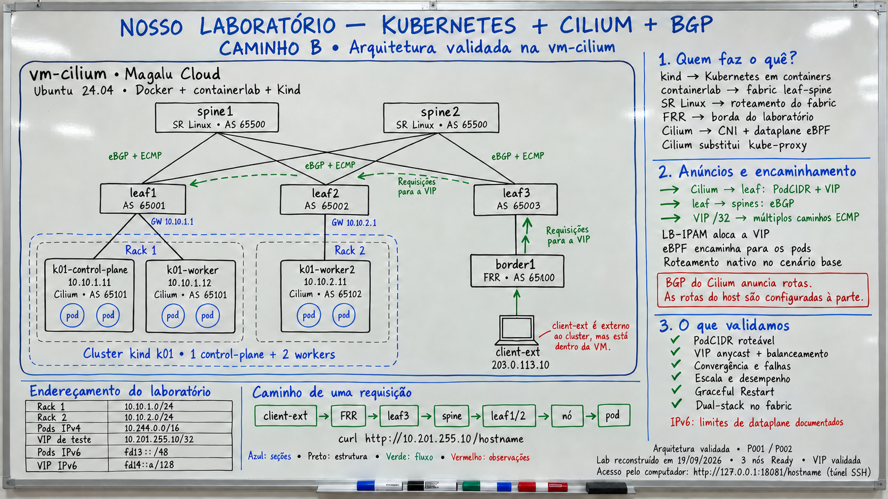
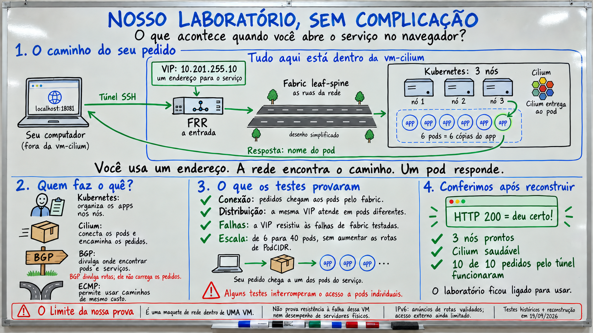

# Kit do laboratório Cilium + BGP

Este diretório contém o cenário reproduzível usado pelo [guia do
estudante 2.0](docs/lab-guide-student.md). O objetivo didático começa por
observar um cluster Kubernetes kind ligado a um fabric leaf–spine e entender a
diferença entre o PodCIDR que o Cilium anuncia e a VIP `/32` de um Service; os
módulos seguintes cobrem Gateway API, autorização, criptografia, tenants, IPAM
e o tenant híbrido com VMs OpenStack, executados no sandbox `studies/p003/`.

## Ambiente de referência

Tudo roda dentro de uma única `vm-cilium` Linux:

- Containerlab: dois spines e três leaves SR Linux `25.3.2`;
- `border1`: FRR `8.4.1`, ligado ao `client-ext`;
- kind `k01`: Kubernetes `v1.35.0`, três nós;
- Cilium `1.20.1`, native routing, BGP Control Plane e IPv6 no plano de controle;
- seis réplicas `echo` e VIP IPv4 `10.201.255.10`;
- enlaces spine–leaf numerados em IPv4 `/31`.

O `client-ext` é externo ao cluster Kubernetes, mas está dentro da VM. O
computador da pessoa estudante acessa a VIP pelo túnel SSH local descrito no
guia. O caminho MKE/gerenciado é uma investigação separada e não é requisito
para este laboratório.

## Estrutura

| Caminho | Conteúdo |
|---|---|
| `topo/` | topologia Containerlab `poc-kind.clab.yml` e cluster kind |
| `configs/srl/` | configurações dos spines e leaves SR Linux |
| `configs/frr/` | daemon e configuração do `border1` |
| `k8s/cilium/` | values do Helm para native routing e dual-stack |
| `k8s/bgp/` | peers, anúncios, racks e pool de VIPs |
| `k8s/apps/` | deployment `echo`, Services e `netshoot` |
| `scripts/` | preparação, deploy, Cilium, BGP, validação e exposição opcional |
| `docs/diagramas/` | imagens da topologia e do fluxo para a aula |

O builder do PDF fica em [`tools/build_guide.py`](tools/build_guide.py), no
diretório `poc-k8s-fabric/tools`, mas é executado a partir da raiz do projeto:

~~~bash
python3 poc-k8s-fabric/tools/build_guide.py
~~~

O PDF sai em `output/pdf/cilium-lab-student-guide.pdf`. Para usar uma cópia do
molde:

~~~bash
python3 poc-k8s-fabric/tools/build_guide.py \
  --scaffold /tmp/meu-guia.md \
  --title "Meu laboratório Cilium"
~~~

O builder depende somente de ReportLab. Consulte
[`tools/requirements-guide.txt`](tools/requirements-guide.txt) se precisar
preparar um ambiente virtual.

## Modelo de anúncios

Cada agente Cilium mantém sua sessão BGP com o leaf do rack e anuncia o
PodCIDR IPv4 `/24` do próprio nó. O Service `echo-anycast`, com
`externalTrafficPolicy: Cluster`, é anunciado como `10.201.255.10/32` por
todos os três nós elegíveis. BGP troca prefixos; ele não executa HTTP nem
instala automaticamente no kernel dos nós as rotas que aprende.

## Estado operacional

O guia pressupõe que o laboratório já esteja no ar. A reconstrução é um
apêndice de instrutor e requer dois terminais: o deploy da topologia aguarda a
API kind, enquanto o kubeconfig dedicado é exportado e o Cilium é instalado no
segundo terminal. Não trate `scripts/99-destroy.sh` como exercício de aluno.

Veja o [resumo público dos resultados](docs/lab-results.md) e as propostas de
[próximos estudos](docs/proximos-estudos.md), agora orientadas aos requisitos
de um produto de conexão dedicada com eBGP. A comparação `/24` × `/32` e o
tenant híbrido com VMs OpenStack já foram executados e estão no guia.

O [índice público dos estudos P003](docs/estudos/README.md) reúne o planejamento
completo, a pesquisa, o contrato, o protocolo e os dossiês E00–E08. Gateway API
é a primeira etapa; o preflight e os experimentos continuam sem execução nesta
publicação.
