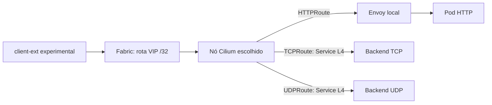

# E01 — Gateway HTTP/TCP/UDP com VIP anunciada por BGP

Sessão prevista S003. Depende de S002 GO e autorização do sandbox. Fontes R03–R08,
R17. Todo caminho é IPv4 inicialmente; dual-stack será uma extensão explícita,
não um PASS IPv6 inferido da presença de CRDs ou sessão MP-BGP.

## Modelo a demonstrar



A VIP alocada não prova anúncio. Anúncio BGP não prova encaminhamento. CEC
programado não prova aplicação. Cada salto terá coleta própria.

## Entregáveis de implementação futura

Sob `poc-k8s-fabric/studies/p003/` (diretório ainda não implementado):

- `topo/`: cópia isolada da topologia + configs renomeadas.
- `base/`: values completos, CRDs adquiridas por versão/hash, BGP, pool e Gateway.
- `fixtures/`: HTTP com marcador, TCP echo e UDP DNS de zona sintética.
- `cases/`: manifests nomeados por caso; `README.md` com comandos explícitos.

O coordenador divide em três tarefas: preparar artefatos offline; revisar/dry-run;
executar bootstrap e probes. Writer não decide endereçamento por conta própria.

## Passos de construção e verificação

1. Ler envelope S002. Renomear cluster, containers, topologia, interfaces/bridges
   e redes. Revisar todos os IPs nos configs FRR/SRL, incluindo rotas estáticas.
   Não copiar o link `clab-ext` ligado à VPC. Guardar diff contra o kit original.
2. Validar que referência e sandbox têm nomes distintos. Inventariar somente os
   recursos a criar. Definir manifests suficientes para reconstituir o sandbox.
3. Preservar kind sem CNI e kube-proxy; usar nome explícito. O deploy pode aguardar
   cluster Ready antes do CNI: documentar dois terminais ou bootstrap em fases.
   Não esperar indefinidamente por Ready antes da instalação do Cilium.
4. Exportar kubeconfig dedicado 0600. Detectar IP da API no container/control-plane
   e na rede management exata; não usar o primeiro IP de Docker inspect.
5. Adquirir CRDs 1.6.1 por tag/commit e checksum; inspecionar YAML local antes de
   aplicar. Incluir TCPRoute, UDPRoute, ListenerSet e HTTPRoute experimental.
6. Instalar Cilium 1.20.2, KPR=true, l7Proxy=true, gatewayAPI.enabled=true,
   hostNetwork=false, native routing e devices apropriados às veths. Helm usa
   `--kubeconfig` e `--kube-context`; não reutilizar implicitamente defaults de k01.
7. Capturar versão/chart/values efetivos, CRD served/storage e UID do cluster.
   Se CRD opcional foi instalada depois do operador, reiniciar só o operador
   experimental, com motivo registrado, e verificar detecção.
8. Instalar peers BGP/pool de VIP restritos ao sandbox. Configurar o anúncio
   Service selecionando label `bgp-advertise=true` e PodCIDR na variante native.
9. Criar workloads: HTTP com corpo contendo namespace/pod, TCP echo com nonce ou
   HTTP usado como payload opaco em TCPRoute, DNS UDP com resposta conhecida.
10. Criar Gateway e Routes. Usar `spec.infrastructure.labels` para o label de
    anúncio do Service gerado; não depender de metadata.labels do Gateway.
11. Inspecionar Service por ownerReference UID, portas e labels; EndpointSlices
    por service-name. Capturar CEC para HTTP. Separar frontend VIP, porta Service,
    porta real de endpoint e nodePort alocado.
12. Confirmar anúncio Cilium e rota no spine/FRR. Disparar probes do cliente
    experimental e correlacionar backend. Repetir após recriar um pod da fixture.

## Manifest conceitual a materializar com IP aprovado

O IP abaixo é candidato do envelope, não autorização para aplicá-lo no k01.

```yaml
apiVersion: gateway.networking.k8s.io/v1
kind: Gateway
metadata:
  name: p003-main
  namespace: p003-gateway
spec:
  gatewayClassName: cilium
  infrastructure:
    labels:
      bgp-advertise: "true"
      study: P003
  addresses:
    - type: IPAddress
      value: 10.202.255.10
  listeners:
    - name: web
      protocol: HTTP
      port: 8080
    - name: tcp-echo
      protocol: TCP
      port: 15432
    - name: udp-dns
      protocol: UDP
      port: 15353
```

As três Routes usam `parentRefs.sectionName` correto. BackendRef.port é porta
do Service, não containerPort por coincidência. Criar todos no mesmo namespace
no primeiro caso, para não misturar ReferenceGrant à prova de rede.

## Matriz mínima

| Caso | Ação | Esperado | Evidência discriminante |
|---|---|---|---|
| GW01 | HTTP VIP:8080 com Host correto | 30/30 com marcador HTTP | resposta + log aplicação + Envoy |
| GW02 | TCP VIP:15432 | 30/30 payload correto | EndpointSlice L4 + captura + marcador TCP |
| GW03 | UDP VIP:15353 consulta DNS sintética | 30/30 resposta e nonce/ID esperado | dig + captura ambos os lados |
| GW04 | Porta TCP não configurada | sem resposta da fixture | erro do cliente + nenhuma chegada na app |
| GW05 | Route TCP anexada ao listener HTTP | rejected/inválida; nenhum backend indevido | conditions e probe negativo |
| GW06 | Backend removido da fixture e restaurado | indisponível e depois recuperado | EndpointSlice antes/depois + probes |
| GW07 | Selector BGP da VIP deixa de casar, só no sandbox | retirada após convergência; controle interno funciona | RIB/FIB + probe externo/interno |

GW07 não exige que conexões antigas caiam instantaneamente. Usar conexões novas
e distinguir cache/conntrack de rota presente. Restaurar selector e repetir GW01–03.

## Comandos de observação

Depois de definir `k` conforme protocolo e STUDY_NS/STUDY_GATEWAY reais:

```bash
k -n "$STUDY_NS" get gateway "$STUDY_GATEWAY" -o json
k -n "$STUDY_NS" get httproutes,tcproutes,udproutes -o yaml
k -n "$STUDY_NS" get services,endpointslices -o json
k -n "$STUDY_NS" get ciliumenvoyconfigs -o json
k -n kube-system get pods -l k8s-app=cilium -o wide
```

No host, CLI Cilium sempre com kubeconfig/context explícitos para `bgp peers`
e `bgp routes advertised ipv4 unicast`. No container spine experimental, usar o
comando `sr_cli` de rota do guia, substituindo apenas prefixo aprovado.
UDP: `dig @"$STUDY_GW_IP" -p 15353 "$STUDY_DNS_NAME" TXT +notcp +ignore +tries=1 +time=2` no client.
Zona sintética local sem forward/cache externo; resposta curta, marker conhecido.
`+ignore` impede fallback automático para TCP se uma resposta vier truncada.
Não usar ping da VIP para decidir se um listener TCP/UDP funciona.

## Diagnóstico e aceite

VIP Pending → pool/selector/address; VIP sem rota → selector no Service e peers;
rota sem SYN no nó → fabric/next-hop; SYN com loop → device/BPF/rota; HTTP falha
com L4 OK → TPROXY/Envoy/config; UDP falha com TCP OK → protocolo/porta/resposta,
não marcar genericamente BGP falho.

PASS exige matriz completa, recursos próprios identificados, baseline k01
inalterado e canários positivos após controles negativos. Não exigir ECMP perfeito
ou 1/N de distribuição com 30 amostras. Critério é alcance e caminho demonstrado.
Rollback: restaurar manifests/selector da célula; preservar sandbox após sucesso
para S004. Destruição do sandbox só se autorizada, por topologia exata e inventário.
